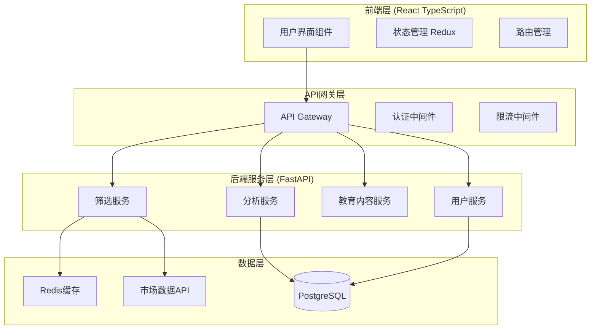
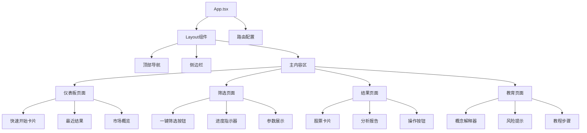

# 设计文档

## 概述

用户友好股票筛选器是对现有A股智能筛选系统的用户体验重构，旨在为小白投资者提供简单易用的股票筛选工具。设计重点关注界面简化、操作流程优化、数据可视化增强和投资教育集成，同时保持现有量价分析算法的技术优势。

## 架构

### 系统架构



### 技术栈选择

**前端技术栈:**
- React 18 with TypeScript - 类型安全的组件开发
- Material-UI v5 - 一致的设计语言和组件库
- Redux Toolkit - 状态管理
- React Query - 数据获取和缓存
- Chart.js - 数据可视化
- React Router v6 - 路由管理

**后端技术栈:**
- FastAPI - 高性能异步API框架
- SQLAlchemy - ORM和数据库操作
- Redis - 缓存和会话存储
- Celery - 异步任务处理
- Pydantic - 数据验证和序列化

## 组件和接口

### 前端组件架构



### 核心组件接口

**StockCard组件:**
```typescript
interface StockCardProps {
  stock: {
    code: string;
    name: string;
    price: number;
    change: number;
    changePercent: number;
    volume: number;
    volumeRatio: number;
    marketCap: number;
    sector: string;
    technicalScore: number;
    riskLevel: 'low' | 'medium' | 'high';
  };
  onViewDetails: (stockCode: string) => void;
  onAddToWatchlist: (stockCode: string) => void;
}
```

**ScreeningService接口:**
```typescript
interface ScreeningService {
  executeScreening(): Promise<ScreeningResult>;
  getScreeningProgress(): Promise<ScreeningProgress>;
  getScreeningHistory(): Promise<ScreeningHistory[]>;
}

interface ScreeningResult {
  selectedStocks: Stock[];
  screeningCriteria: ScreeningCriteria;
  executionTime: number;
  timestamp: Date;
}
```

### API接口设计

**筛选相关API:**
```python
# 一键筛选接口
POST /api/v1/screening/execute
Response: {
    "task_id": "uuid",
    "status": "started",
    "estimated_duration": 30
}

# 获取筛选进度
GET /api/v1/screening/progress/{task_id}
Response: {
    "status": "running|completed|failed",
    "progress": 75,
    "current_step": "精选过滤中",
    "result": StockList | null
}

# 获取筛选结果
GET /api/v1/screening/result/{task_id}
Response: {
    "stocks": [StockDetail],
    "criteria": ScreeningCriteria,
    "analysis": AnalysisReport
}
```

**分析报告API:**
```python
# 生成股票分析报告
GET /api/v1/analysis/stock/{stock_code}
Response: {
    "basic_info": BasicInfo,
    "technical_analysis": TechnicalAnalysis,
    "screening_reason": ScreeningReason,
    "risk_assessment": RiskAssessment,
    "educational_content": EducationalContent
}
```

## 数据模型

### 核心数据模型

**Stock模型:**
```python
class Stock(BaseModel):
    code: str
    name: str
    price: Decimal
    change: Decimal
    change_percent: Decimal
    volume: int
    volume_ratio: Decimal
    market_cap: Decimal
    sector: str
    industry: str
    
    # 技术指标
    ma5: Decimal
    ma10: Decimal
    ma20: Decimal
    recent_high: Decimal
    support_level: Decimal
    
    # 筛选相关
    screening_score: int
    risk_level: RiskLevel
    selected_reason: List[str]
```

**ScreeningCriteria模型:**
```python
class ScreeningCriteria(BaseModel):
    # 初步筛选条件
    min_change_percent: Decimal = 2.0
    max_change_percent: Decimal = 6.0
    min_volume_ratio: Decimal = 1.5
    max_volume_ratio: Decimal = 3.0
    min_market_cap: Decimal = 8000000000  # 80亿
    max_market_cap: Decimal = 35000000000  # 350亿
    
    # 精选过滤条件
    require_volume_ladder: bool = True
    require_above_ma5: bool = True
    require_near_high: bool = True
    preferred_sectors: List[str] = ["数字经济"]
```

**AnalysisReport模型:**
```python
class AnalysisReport(BaseModel):
    stock_code: str
    generated_at: datetime
    
    # 筛选理由
    selection_reasons: List[SelectionReason]
    
    # 技术分析
    technical_indicators: Dict[str, Any]
    price_trend: TrendAnalysis
    volume_analysis: VolumeAnalysis
    
    # 风险评估
    risk_factors: List[RiskFactor]
    risk_score: int
    
    # 教育内容
    concept_explanations: List[ConceptExplanation]
    investment_tips: List[str]
```

### 数据库设计

```sql
-- 用户表
CREATE TABLE users (
    id UUID PRIMARY KEY,
    username VARCHAR(50) UNIQUE NOT NULL,
    email VARCHAR(100) UNIQUE NOT NULL,
    preferences JSONB,
    created_at TIMESTAMP DEFAULT NOW()
);

-- 筛选历史表
CREATE TABLE screening_history (
    id UUID PRIMARY KEY,
    user_id UUID REFERENCES users(id),
    criteria JSONB NOT NULL,
    results JSONB NOT NULL,
    execution_time INTEGER,
    created_at TIMESTAMP DEFAULT NOW()
);

-- 用户关注股票表
CREATE TABLE user_watchlist (
    id UUID PRIMARY KEY,
    user_id UUID REFERENCES users(id),
    stock_code VARCHAR(10) NOT NULL,
    added_at TIMESTAMP DEFAULT NOW(),
    UNIQUE(user_id, stock_code)
);

-- 教育内容表
CREATE TABLE educational_content (
    id UUID PRIMARY KEY,
    concept_key VARCHAR(50) UNIQUE NOT NULL,
    title VARCHAR(200) NOT NULL,
    content TEXT NOT NULL,
    difficulty_level INTEGER DEFAULT 1,
    created_at TIMESTAMP DEFAULT NOW()
);
```

## 用户界面设计

### 设计原则

1. **简洁性** - 减少认知负担，突出核心功能
2. **一致性** - 统一的视觉语言和交互模式
3. **可访问性** - 支持不同设备和用户能力
4. **渐进式披露** - 根据用户需求逐步展示信息
5. **即时反馈** - 提供清晰的状态指示和操作反馈

### 主要页面设计

**仪表板页面:**
```
┌─────────────────────────────────────────────────────┐
│ 🏠 股票筛选器                    [用户] [设置] [帮助] │
├─────────────────────────────────────────────────────┤
│                                                     │
│  📊 今日市场概览                                     │
│  ┌─────────┐ ┌─────────┐ ┌─────────┐ ┌─────────┐    │
│  │上证指数  │ │深证成指  │ │创业板指  │ │科创50   │    │
│  │3,234.56│ │12,345.67│ │2,456.78 │ │1,234.56│    │
│  │+1.23%  │ │-0.45%   │ │+2.34%   │ │+0.78%  │    │
│  └─────────┘ └─────────┘ └─────────┘ └─────────┘    │
│                                                     │
│  🎯 一键智能筛选                                     │
│  ┌─────────────────────────────────────────────────┐│
│  │         [🚀 开始筛选优质股票]                    ││
│  │                                                 ││
│  │  💡 基于量价分析，为您筛选3只潜力股票             ││
│  │     预计用时：30秒                              ││
│  └─────────────────────────────────────────────────┘│
│                                                     │
│  📈 最近筛选结果                                     │
│  ┌─────────────────────────────────────────────────┐│
│  │ 2024-01-15 14:30  ✅ 筛选成功  [查看详情]       ││
│  │ 找到3只优质股票：平安银行、比亚迪、宁德时代       ││
│  └─────────────────────────────────────────────────┘│
│                                                     │
└─────────────────────────────────────────────────────┘
```

**筛选进行中页面:**
```
┌─────────────────────────────────────────────────────┐
│ 🔍 正在为您筛选股票...                               │
├─────────────────────────────────────────────────────┤
│                                                     │
│  ⏱️  预计剩余时间：15秒                              │
│                                                     │
│  ████████████████░░░░░░░░ 75%                       │
│                                                     │
│  📋 当前步骤：精选过滤中                             │
│                                                     │
│  ✅ 初步筛选完成 - 找到47只候选股票                  │
│  🔄 精选过滤进行中 - 应用高级技术指标                │
│  ⏳ 生成分析报告 - 等待中                            │
│                                                     │
│  💡 小贴士：                                        │
│  量价分析是通过观察股票价格和成交量的关系            │
│  来判断股票走势的技术分析方法                        │
│                                                     │
│                    [取消筛选]                        │
│                                                     │
└─────────────────────────────────────────────────────┘
```

**结果展示页面:**
```
┌─────────────────────────────────────────────────────┐
│ 🎉 筛选完成！为您找到3只优质股票                     │
├─────────────────────────────────────────────────────┤
│                                                     │
│ 📊 筛选结果 (2024-01-15 14:32)                      │
│                                                     │
│ ┌─────────────────────────────────────────────────┐ │
│ │ 🏆 #1 平安银行 (000001)                         │ │
│ │ 💰 ¥12.34 (+3.45%)  📈 技术评分：85/100        │ │
│ │ 📊 量比：2.1  💎 市值：245亿                    │ │
│ │ ✨ 筛选理由：阶梯式放量，站稳5日线               │ │
│ │ [📋 详细分析] [⭐ 加入关注] [📤 分享]           │ │
│ └─────────────────────────────────────────────────┘ │
│                                                     │
│ ┌─────────────────────────────────────────────────┐ │
│ │ 🥈 #2 比亚迪 (002594)                           │ │
│ │ 💰 ¥245.67 (+4.12%)  📈 技术评分：82/100       │ │
│ │ 📊 量比：1.8  💎 市值：712亿                    │ │
│ │ ✨ 筛选理由：数字经济板块，突破近期高点           │ │
│ │ [📋 详细分析] [⭐ 加入关注] [📤 分享]           │ │
│ └─────────────────────────────────────────────────┘ │
│                                                     │
│ ┌─────────────────────────────────────────────────┐ │
│ │ 🥉 #3 宁德时代 (300750)                         │ │
│ │ 💰 ¥156.78 (+2.89%)  📈 技术评分：79/100       │ │
│ │ 📊 量比：2.3  💎 市值：689亿                    │ │
│ │ ✨ 筛选理由：量价配合良好，技术形态佳             │ │
│ │ [📋 详细分析] [⭐ 加入关注] [📤 分享]           │ │
│ └─────────────────────────────────────────────────┘ │
│                                                     │
│ ⚠️  投资有风险，以上结果仅供参考，不构成投资建议     │
│                                                     │
│ [🔄 重新筛选] [📚 学习投资知识] [💾 保存结果]       │
│                                                     │
└─────────────────────────────────────────────────────┘
```

### 响应式设计

**移动端适配:**
- 使用Material-UI的响应式断点系统
- 卡片式布局适配小屏幕
- 触摸友好的按钮和交互元素
- 简化的导航结构

**平板端优化:**
- 利用更大屏幕空间展示更多信息
- 支持横屏和竖屏模式
- 优化的图表和数据可视化

## 错误处理

### 错误分类和处理策略

**网络错误:**
```typescript
class NetworkErrorHandler {
  handleConnectionError(): void {
    // 显示离线提示
    // 启用离线模式
    // 提供重试机制
  }
  
  handleTimeoutError(): void {
    // 显示超时提示
    // 自动重试机制
    // 降级到缓存数据
  }
}
```

**数据错误:**
```python
class DataErrorHandler:
    def handle_market_data_unavailable(self):
        # 使用缓存数据
        # 显示数据时效性警告
        # 提供手动刷新选项
        
    def handle_screening_no_results(self):
        # 调整筛选参数
        # 提供替代建议
        # 显示市场状况说明
```

**用户错误:**
- 输入验证和友好提示
- 操作确认和撤销机制
- 渐进式错误恢复指导

### 错误用户界面

```
┌─────────────────────────────────────────────────────┐
│ ⚠️  筛选暂时无法完成                                 │
├─────────────────────────────────────────────────────┤
│                                                     │
│ 😔 抱歉，由于市场数据更新中，暂时无法完成筛选        │
│                                                     │
│ 💡 您可以：                                         │
│ • [🔄 重试筛选] - 稍后再试                          │
│ • [📊 查看历史结果] - 查看之前的筛选结果             │
│ • [📚 学习投资知识] - 利用等待时间学习               │
│                                                     │
│ 🕐 预计恢复时间：5分钟内                            │
│                                                     │
│ 如果问题持续存在，请联系客服：support@example.com   │
│                                                     │
└─────────────────────────────────────────────────────┘
```

## 测试策略

### 测试金字塔

**单元测试 (70%)**
- 组件逻辑测试
- 工具函数测试
- API接口测试
- 数据模型验证测试

**集成测试 (20%)**
- API集成测试
- 数据库集成测试
- 第三方服务集成测试
- 前后端集成测试

**端到端测试 (10%)**
- 关键用户流程测试
- 跨浏览器兼容性测试
- 性能测试
- 可访问性测试

### 测试工具和框架

**前端测试:**
- Jest + React Testing Library - 组件测试
- Cypress - 端到端测试
- Storybook - 组件文档和视觉测试

**后端测试:**
- pytest - Python单元测试
- pytest-asyncio - 异步测试
- httpx - API测试客户端
- factory_boy - 测试数据生成

### 性能测试

**前端性能:**
- Lighthouse CI - 性能监控
- Bundle分析和优化
- 图片和资源优化
- 懒加载和代码分割

**后端性能:**
- 负载测试 (Locust)
- 数据库查询优化
- 缓存策略验证
- API响应时间监控

## 正确性属性

*属性是应该在系统所有有效执行中保持为真的特征或行为——本质上是关于系统应该做什么的正式陈述。属性作为人类可读规范和机器可验证正确性保证之间的桥梁。*

基于需求分析，以下是用户友好股票筛选器的核心正确性属性：

### 属性 1: 用户界面帮助内容完整性
*对于任何*功能组件，该组件都应该包含相应的帮助说明或解释文本
**验证需求：需求 1.3**

### 属性 2: 用户操作反馈一致性  
*对于任何*用户界面操作，执行操作后系统都应该提供相应的视觉反馈或状态变化
**验证需求：需求 1.4**

### 属性 3: 响应式界面适配性
*对于任何*屏幕尺寸，界面元素都应该正确适配并保持可用性
**验证需求：需求 1.5**

### 属性 4: 筛选流程触发正确性
*对于任何*"开始筛选"按钮点击操作，系统都应该启动完整的筛选流程（初步筛选+精选过滤）
**验证需求：需求 2.1**

### 属性 5: 筛选进度显示一致性
*对于任何*正在进行的筛选任务，系统都应该显示进度指示器和当前步骤信息
**验证需求：需求 2.2**

### 属性 6: 筛选结果数量正确性
*对于任何*成功完成的筛选操作，系统都应该返回恰好3只精选股票（除非市场中符合条件的股票少于3只）
**验证需求：需求 2.3**

### 属性 7: 错误处理完整性
*对于任何*筛选失败的情况，系统都应该显示友好的错误信息和重试选项
**验证需求：需求 2.4**

### 属性 8: 重新筛选功能可用性
*对于任何*重新筛选请求，系统都应该能够重新执行完整的筛选流程
**验证需求：需求 2.5**

### 属性 9: 数据展示格式一致性
*对于任何*股票数据展示，都应该使用卡片式布局、颜色编码、图标和百分比等视觉元素来增强可读性
**验证需求：需求 3.1, 3.2, 3.3**

### 属性 10: 教育内容展示完整性
*对于任何*技术指标或筛选结果展示，都应该包含相应的解释说明和免责声明
**验证需求：需求 4.2, 4.3, 4.4**

### 属性 11: 分析报告生成完整性
*对于任何*精选股票，系统都应该生成包含筛选理由、技术指标解释和基本面信息的完整分析报告
**验证需求：需求 5.1, 5.2, 5.3**

### 属性 12: 报告交互功能可用性
*对于任何*分析报告，都应该提供展开/收起、保存和分享等交互功能
**验证需求：需求 5.4, 5.5**

### 属性 13: 筛选算法参数正确性
*对于任何*筛选操作，初步筛选应该应用涨幅2%-6%、量比1.5-3、市值80-350亿的条件，精选过滤应该检查阶梯式放量、站稳5日线+近期高点、数字经济板块等条件
**验证需求：需求 6.1, 6.2**

### 属性 14: 异常处理优雅降级
*对于任何*筛选过程中的异常情况，系统都应该记录错误日志并提供优雅的降级处理
**验证需求：需求 6.3**

### 属性 15: 数据同步一致性
*对于任何*市场数据更新，系统都应该自动刷新筛选所使用的基础数据
**验证需求：需求 6.4**

### 属性 16: 空结果处理策略
*对于任何*筛选结果为空的情况，系统都应该调整参数并提供替代建议
**验证需求：需求 6.5**

### 属性 17: 筛选响应时间保证
*对于任何*筛选请求，系统都应该在30秒内返回结果或明确的状态信息
**验证需求：需求 7.1**

### 属性 18: 网络异常处理能力
*对于任何*网络连接问题，系统都应该提供离线缓存和重连机制
**验证需求：需求 7.3**

### 属性 19: 数据源异常状态显示
*对于任何*数据源问题，系统都应该显示明确的状态信息和预计恢复时间
**验证需求：需求 7.4**

### 属性 20: 用户偏好持久化
*对于任何*用户设置的偏好，系统都应该正确保存并在后续访问中恢复
**验证需求：需求 8.1**

### 属性 21: 历史记录保存完整性
*对于任何*用户的筛选操作，系统都应该保存历史记录并支持查看
**验证需求：需求 8.2**

### 属性 22: 股票收藏功能正确性
*对于任何*用户的股票收藏操作，系统都应该正确保存收藏状态并提供管理功能
**验证需求：需求 8.3**
## 错误处理

### 错误分类和处理策略

**网络和连接错误:**
```typescript
class NetworkErrorHandler {
  handleConnectionError(): void {
    // 显示离线模式提示
    // 启用缓存数据访问
    // 提供手动重连选项
    // 自动重连机制（指数退避）
  }
  
  handleTimeoutError(): void {
    // 显示超时友好提示
    // 自动重试机制（最多3次）
    // 降级到历史数据展示
    // 提供取消操作选项
  }
  
  handleRateLimitError(): void {
    // 显示请求频率限制提示
    // 显示预计等待时间
    // 提供稍后重试选项
  }
}
```

**数据和业务逻辑错误:**
```python
class BusinessErrorHandler:
    def handle_market_data_unavailable(self):
        """处理市场数据不可用"""
        # 使用最近的缓存数据
        # 显示数据时效性警告
        # 提供数据来源说明
        # 记录数据缺失日志
        
    def handle_screening_no_results(self):
        """处理筛选无结果"""
        # 放宽筛选条件重试
        # 提供市场状况解释
        # 推荐相关股票或板块
        # 提供历史成功案例
        
    def handle_invalid_stock_data(self):
        """处理无效股票数据"""
        # 跳过无效数据项
        # 记录数据质量问题
        # 通知数据提供方
        # 继续处理其他有效数据
```

**用户操作错误:**
```typescript
class UserErrorHandler {
  handleInvalidInput(input: string, field: string): void {
    // 显示具体的输入错误提示
    // 提供正确格式示例
    // 高亮错误字段
    // 保留用户已输入的有效内容
  }
  
  handleUnauthorizedAccess(): void {
    // 友好的权限提示
    // 引导用户登录或注册
    // 保存用户当前操作状态
    // 登录后恢复操作
  }
  
  handleSessionExpired(): void {
    // 显示会话过期提示
    // 自动保存用户数据
    // 提供快速重新登录
    // 恢复用户工作状态
  }
}
```

### 错误用户界面设计

**通用错误页面模板:**
```
┌─────────────────────────────────────────────────────┐
│ 😔 出了点小问题                                      │
├─────────────────────────────────────────────────────┤
│                                                     │
│ [错误图标] [错误标题]                                │
│                                                     │
│ [友好的错误描述]                                     │
│                                                     │
│ 💡 您可以尝试：                                     │
│ • [主要解决方案按钮]                                 │
│ • [备选方案按钮]                                     │
│ • [帮助或联系支持按钮]                               │
│                                                     │
│ [错误代码：仅在需要时显示]                           │
│                                                     │
└─────────────────────────────────────────────────────┘
```

**具体错误场景:**

1. **筛选超时错误:**
```
😴 筛选用时较长，请稍等片刻
市场数据较多，正在努力为您筛选最优股票...
预计还需要：30秒
[继续等待] [查看历史结果] [取消筛选]
```

2. **网络连接错误:**
```
📡 网络连接不稳定
无法获取最新市场数据，但您可以查看缓存的结果
[重试连接] [查看离线数据] [检查网络设置]
```

3. **无筛选结果错误:**
```
🔍 当前市场条件下暂无符合条件的股票
市场波动较大，建议稍后再试或调整筛选条件
[放宽条件重试] [查看市场分析] [设置提醒]
```

## 测试策略

### 双重测试方法

**单元测试 (60%)**
- React组件渲染和交互测试
- 业务逻辑函数测试
- API端点单独测试
- 数据模型验证测试
- 工具函数和帮助方法测试

**属性测试 (30%)**
- 筛选算法正确性验证
- 用户界面一致性检查
- 数据展示格式验证
- 错误处理完整性测试
- 性能要求验证

**集成测试 (10%)**
- 前后端API集成测试
- 数据库操作集成测试
- 第三方服务集成测试
- 端到端用户流程测试

### 属性测试配置

**测试框架选择:**
- **前端**: Jest + @fast-check/jest (JavaScript属性测试)
- **后端**: pytest + Hypothesis (Python属性测试)

**测试配置要求:**
- 每个属性测试最少运行100次迭代
- 使用随机种子确保可重现性
- 测试超时设置为30秒
- 失败时保存反例用于调试

**属性测试标签格式:**
```typescript
// Feature: user-friendly-stock-screener, Property 1: 用户界面帮助内容完整性
test('UI components should have help content', () => {
  fc.assert(fc.property(
    fc.record({
      componentType: fc.constantFrom('button', 'input', 'card', 'chart'),
      hasHelpText: fc.boolean(),
      helpContent: fc.string()
    }),
    (component) => {
      // 属性测试逻辑
      expect(component.hasHelpText).toBe(true);
      expect(component.helpContent).toBeTruthy();
    }
  ), { numRuns: 100 });
});
```

### 测试数据生成策略

**股票数据生成器:**
```python
from hypothesis import strategies as st

@st.composite
def stock_data_strategy(draw):
    return {
        'code': draw(st.text(min_size=6, max_size=6, alphabet='0123456789')),
        'name': draw(st.text(min_size=2, max_size=10, alphabet='中文字符集')),
        'price': draw(st.decimals(min_value=1, max_value=1000, places=2)),
        'change_percent': draw(st.decimals(min_value=-10, max_value=10, places=2)),
        'volume_ratio': draw(st.decimals(min_value=0.1, max_value=5.0, places=1)),
        'market_cap': draw(st.integers(min_value=1000000000, max_value=1000000000000))
    }
```

**用户交互生成器:**
```typescript
const userActionGenerator = fc.record({
  actionType: fc.constantFrom('click', 'input', 'scroll', 'hover'),
  target: fc.constantFrom('button', 'input', 'link', 'card'),
  timestamp: fc.integer(min: 0, max: Date.now()),
  userId: fc.uuid()
});
```

### 性能测试要求

**前端性能指标:**
- 首次内容绘制 (FCP) < 1.5秒
- 最大内容绘制 (LCP) < 2.5秒
- 首次输入延迟 (FID) < 100毫秒
- 累积布局偏移 (CLS) < 0.1

**后端性能指标:**
- 筛选API响应时间 < 30秒
- 数据查询响应时间 < 2秒
- 并发用户支持 > 100
- 系统可用性 > 99.5%

**测试工具配置:**
```javascript
// Lighthouse CI 配置
module.exports = {
  ci: {
    collect: {
      numberOfRuns: 3,
      url: ['http://localhost:3000', 'http://localhost:3000/screening']
    },
    assert: {
      assertions: {
        'categories:performance': ['error', {minScore: 0.8}],
        'categories:accessibility': ['error', {minScore: 0.9}],
        'categories:best-practices': ['error', {minScore: 0.8}]
      }
    }
  }
};
```

### 可访问性测试

**自动化可访问性测试:**
```typescript
import { axe, toHaveNoViolations } from 'jest-axe';

expect.extend(toHaveNoViolations);

test('应该符合WCAG 2.1 AA标准', async () => {
  const { container } = render(<StockScreeningApp />);
  const results = await axe(container);
  expect(results).toHaveNoViolations();
});
```

**手动测试检查清单:**
- 键盘导航完整性
- 屏幕阅读器兼容性
- 颜色对比度符合标准
- 焦点指示器清晰可见
- 替代文本完整准确

### 测试环境配置

**开发环境测试:**
- 本地单元测试和属性测试
- 组件Storybook视觉测试
- API模拟和集成测试

**CI/CD环境测试:**
- 自动化测试套件执行
- 代码覆盖率检查 (>80%)
- 性能回归测试
- 安全漏洞扫描

**预生产环境测试:**
- 端到端用户流程测试
- 负载和压力测试
- 真实数据兼容性测试
- 跨浏览器兼容性测试